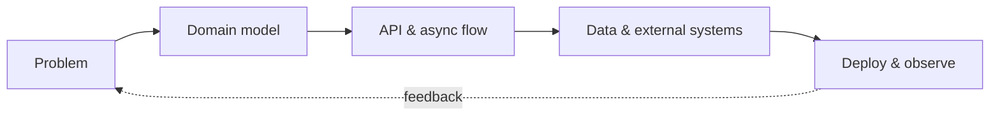

<div align="center">


[](https://git.io/typing-svg)

<a href="https://github.com/zzl-hyun?tab=repositories"></a>
<a href="mailto:kimgihyun877@gmail.com"></a>
<a href="https://github.com/zzl-hyun?tab=followers"></a>


</div>

## `> whoami`

```text
현실의 복잡한 문제를 명확한 도메인과 안정적인 API로 바꿉니다.
AI 작업 파이프라인부터 실시간 통신, 외부 API 연동까지
서비스의 흐름 전체를 이해하고 끝까지 구현하는 백엔드 개발자입니다.
```

- **Product-minded** — 기능의 개수보다 사용자의 병목을 먼저 찾습니다.
- **Architecture-aware** — 책임, 경계, 실패 지점을 설계에 드러냅니다.
- **Production-ready** — 비동기 처리, 실시간 갱신, 배포와 운영까지 고민합니다.

## Featured builds

<table>
<tr>
<td width="50%" valign="top">
<p align="center">
  <a href="https://github.com/joomidang"></a>
</p>
<h3 align="center">Paper Summarizer</h3>
<p><b>GPT 기반 논문 요약·시각화 플랫폼</b></p>
<p>문서 처리와 AI 요약 작업을 분리한 백엔드/워커 구조. 긴 작업의 경계를 나누고 서비스 간 흐름을 설계했습니다.</p>
<p><b>My Impact</b> · 공개 커밋 107회<br/>회원·인증 API와 배포/콜백 연동을 구현하고, Gemini/OpenAI 요약 워커를 개선했습니다.</p>
<p><code>Spring Boot</code> <code>Java</code> <code>Python</code> <code>AI Pipeline</code></p>
<a href="https://github.com/joomidang/paper-summarizer-backend">Backend →</a><br/>
<a href="https://github.com/joomidang/paper-summarizer-summry-worker">Summary Worker →</a>
</td>
<td width="50%" valign="top">
<p align="center">
  <a href="https://github.com/UMC-GameCast"></a>
</p>
<h3 align="center">GameCast</h3>
<p><b>게임 플레이를 실시간으로 연결하는 미디어 서버</b></p>
<p>Socket.IO/WebRTC 시그널링, 녹화 흐름과 AI 하이라이트 콜백을 연결하고 S3 기반 미디어 파이프라인을 구축했습니다.</p>
<p><b>My Impact</b> · 공개 커밋 136회<br/>룸·영상·WebRTC 서비스와 하이라이트 콜백을 구현하고, Docker/AWS CI/CD 흐름을 구축했습니다.</p>
<p><code>TypeScript</code> <code>Express</code> <code>WebRTC</code> <code>Socket.IO</code></p>
<a href="https://github.com/UMC-GameCast/gamecast-server">Server →</a>
</td>
</tr>
<tr>
<td colspan="2" valign="top">
<p align="center">
  <a href="https://github.com/project-GMG"></a>
</p>
<h3 align="center">GMG — 가면가</h3>
<p><b>비선호 데이터를 이용해 약속 조율 비용을 줄이는 서비스</b></p>
<p>30분 단위 히트맵과 장소 추천을 계산하고, 트랜잭션 커밋 이후 SSE로 결과를 갱신합니다. Kakao/Google Maps 데이터를 결합해 영업시간과 참여자 비선호까지 추천에 반영했습니다.</p>
<p><b>My Impact</b> · 공개 커밋 24회<br/>참여자 시간표 조회·수정, 동시 참여 레이스 컨디션 방지, 히트맵 집계 정합성을 개선했습니다.</p>
<p><code>Java 21</code> <code>Spring Boot 3.5</code> <code>JPA</code> <code>Flyway</code> <code>MySQL</code> <code>SSE</code></p>
<a href="https://github.com/project-GMG/backend">Backend →</a>
<br/><br/>
<p align="center">
  
  &nbsp;
  
</p>
</td>
</tr>
</table>

<div align="center">
  <a href="https://github.com/joomidang/paper-summarizer-backend"></a>
  <a href="https://github.com/joomidang/paper-summarizer-summry-worker"></a>
  <a href="https://github.com/UMC-GameCast/gamecast-server"></a>
  <a href="https://github.com/project-GMG/backend"></a>
</div>

### Side quests

<sub>생활 속 작은 불편을 그냥 지나치지 않고 직접 도구로 해결합니다.</sub>

| Project | What it does | Built with |
|---|---|---|
| [🧾 Automatic Settlement](https://github.com/zzl-hyun/Automatic-settlement) | 참여자별 지출을 1/N로 나누고 최종 송금 내역을 계산하는 브라우저 가계부 | `Vanilla JS` `localStorage` |
| [🎵 Taskbar Music Widget](https://github.com/zzl-hyun/TaskbarMusicWidget) | Windows 작업표시줄에서 재생 제어·곡 정보·앱별 음량을 다루는 미니 위젯 | `.NET 8` `WPF` `NAudio` |
| [⚡ Taskbar Speed Control](https://github.com/zzl-hyun/TaskbarSpeedControl) | 작업표시줄 자동 숨김 속도와 프레임을 네이티브 훅으로 제어하는 유틸리티 | `C#` `C++` `WinAPI` |

## Engineering toolbox

<div align="center">

### Core

[](https://skillicons.dev)

### Data · Infra · Delivery

[](https://skillicons.dev)

</div>



<details>
<summary><b>What I care about when building</b></summary>
<br/>

| Area | Focus |
|---|---|
| API | 예측 가능한 계약, 일관된 오류 응답, 입력 경계 검증 |
| Data | 명시적인 트랜잭션 경계, 안전한 마이그레이션, 쿼리 비용 |
| Async | 재시도와 멱등성, 이벤트 발행 시점, 실패 격리 |
| Real-time | 연결 수명주기, heartbeat, 프록시 버퍼링, graceful cleanup |
| Delivery | 재현 가능한 빌드, 컨테이너화, 환경별 설정 분리 |

</details>

## Proof of work

<div align="center">
  
  
  
</div>

### Languages activity

<div align="center">
  
</div>

### Isometric contribution calendar

<div align="center">
  
</div>

<div align="center">

### Build clearly. Ship reliably. Improve continuously.

<sub>Thanks for stopping by — interesting systems are always worth a conversation.</sub>


</div>
