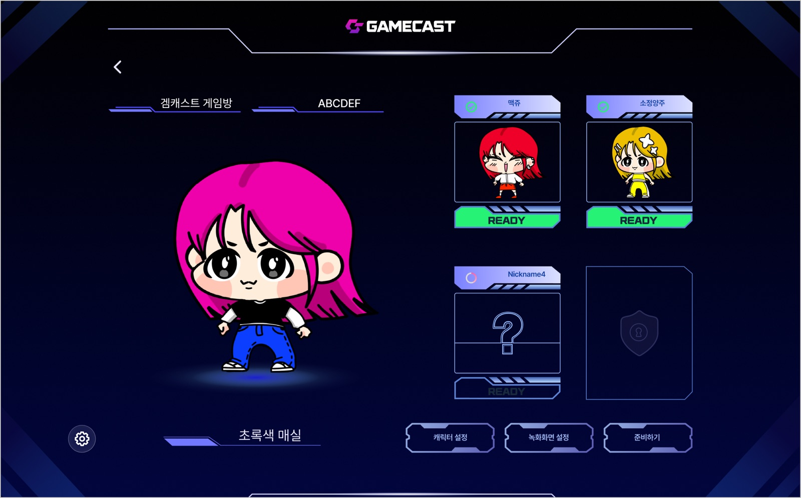
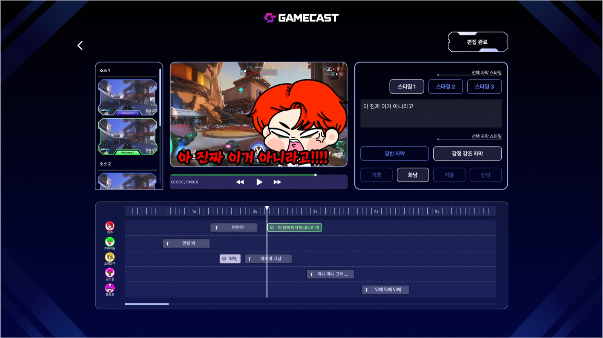

<h1>KIHYEON KIM</h1>

<b>Developer</b>

  <a href="https://github.com/zzl-hyun">GitHub</a> ·
  <a href="mailto:kimgihyun877@gmail.com">Email</a>

### Core

### Data · Infra · Delivery

## Commit Activity

  

### Contribution Calendar

  <picture>
    <source media="(prefers-color-scheme: dark)" srcset="https://raw.githubusercontent.com/zzl-hyun/zzl-hyun/output-3d-contrib/night.svg" />
    <source media="(prefers-color-scheme: light)" srcset="https://raw.githubusercontent.com/zzl-hyun/zzl-hyun/output-3d-contrib/day.svg" />
    
  </picture>

## Projects

### Paper Summarizer

> LLM 기반 논문 요약·시각화 플랫폼

문서 처리와 AI 요약 작업을 분리한 백엔드·워커 구조에서 파싱 모델 서버를 구축하고 서비스 간 작업 흐름을 설계했습니다. 콜백 연동과 Gemini·OpenAI 기반 요약 워커를 구현했습니다.

`Spring Boot` `Java` `Python` `AI Pipeline` `Google Gen AI SDK` `Docker` `AWS`

[Backend](https://github.com/joomidang/paper-summarizer-backend) · [Summary Worker](https://github.com/joomidang/paper-summarizer-summry-worker) · [Presentation](https://foil-tiglon-4b0.notion.site/LLM-3a8e7043597980a88854ddd802966579)

---

### GMG · 가면가

> 참여자의 비선호 데이터를 활용해 약속 조율 비용을 줄이는 서비스

30분 단위 히트맵과 장소 추천을 계산하고, 트랜잭션 커밋 이후 SSE로 결과를 갱신합니다.
참여자 시간표 조회·수정, 동시 참여 레이스 컨디션 방지, 히트맵 집계 정합성을 개선했습니다.

`Java 21` `Spring Boot 3.5` `JPA` `Flyway` `MySQL` `SSE` `Docker` `AWS`

[Backend](https://github.com/project-GMG/backend)

  
  &nbsp;
  

---

### GameCast

> 멀티플레이 세션을 녹화하고 AI 하이라이트를 생성하는 숏폼 제작 도구

게임방 참가자의 화면, 게임 오디오, 마이크를 개별 녹화하고 음성을 추출해 하이라이트 구간을 탐지합니다.
탐지 결과를 기반으로 하이라이트 영상 3개를 생성하고, 방장이 레이어 기반 편집 화면에서 클립과 미디어 요소를 조합해 숏폼 영상을 완성할 수 있도록 지원합니다.
룸·영상·WebRTC 서비스와 AI 하이라이트 콜백을 구현하고, S3 기반 미디어 파이프라인과 Docker·AWS CI/CD 환경을 구축했습니다.

`TypeScript` `Express` `WebRTC` `Socket.IO` `Docker` `AWS` `YAMNet`

[Server](https://github.com/UMC-GameCast/gamecast-server)

  
  &nbsp;
  

### Independent Projects

| Project | Description | Technology |
|---|---|---|
| [Automatic Settlement](https://github.com/zzl-hyun/Automatic-settlement) | 참여자별 분담 금액과 최종 송금 내역을 계산하는 정산 도구 | `Vanilla JS` `localStorage` |
| [Taskbar Music Widget](https://github.com/zzl-hyun/TaskbarMusicWidget) | Windows 작업 표시줄에서 재생 정보와 앱별 음량을 제어하는 위젯 | `.NET 8` `WPF` `NAudio` |
| [Taskbar Speed Control](https://github.com/zzl-hyun/TaskbarSpeedControl) | 작업 표시줄 자동 숨김 속도와 프레임을 제어하는 유틸리티 | `C#` `C++` `WinAPI` |
| [macOS Preview Image Paste](https://github.com/zzl-hyun/MacOS-preview-image-paste) | PNG 데이터를 미리보기 호환 객체로 변환해 PDF에 붙여넣을 수 있게 하는 도구 | `Swift` `Shell` `AnnotationKit` |

## Education

### Jeonbuk National University

- 컴퓨터공학부
- GPA `4.10 / 4.50` · Rank `7 / 94`

## Activities

### [SK AI Leader Academy (SKALA) 4th](https://2026skala.co.kr/)

- 실무형 AI 인재 프로그램 · 26.07~26.12
- AI 실무 교육 및 SK그룹 비즈니스 문제 기반 팀 프로젝트 수행

### [PAGE (Purdue Academy of Global Engineering)](https://engineering.purdue.edu/GEP/Global-Opportunities/PAGE)

- [Purdue University](https://www.purdue.edu/)
- PAGE · `Big Data & AI` · 25.06~25.07

### [UMC 8th](https://umc.makeus.in/)

- Server(Node.js) 파트 시니어 코스 수료 · 25.03~25.08
- GameCast 서버 개발에 참여해 WebRTC 시그널링, 녹화, AI 하이라이트 연동 및 배포 환경 구축

## Awards

### [산학협력 SW캡스톤디자인 경진대회 최우수상](https://swuniv.jbnu.ac.kr/festival/jbnusw?gc=893BAOF&do=view&festival_id=gvyje9Tei6W679047c5&syear=2025&content_id=bzCg8OImfwl6886e13f)

- **주최** · 전북대학교 SW중심대학사업단
- **수상일** · 2025.06.20
- **과제** · LLM을 활용한 AI 논문 요약 및 시각화 플랫폼
- **프로젝트** · [Paper Summarizer](https://github.com/joomidang/paper-summarizer-backend)

## Certifications

| Certification | Detail | Date |
|---|---:|---:|
| 정보처리기사 | 국가기술자격 | 2025.12 |
| 빅데이터분석기사 | 국가기술자격 | 2025.12 |
| TOEIC Speaking | 140 | 2025.02 |
| TOEIC | 850 | 2024.08 |
